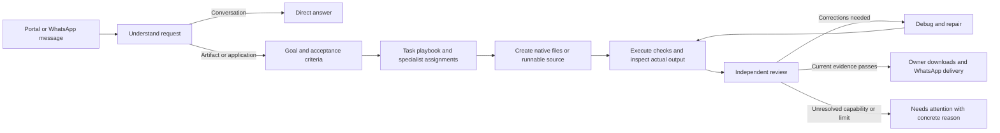

# CW Agent

**Autonomous task orchestration with AntiGravity CLI, WhatsApp and a private PHP portal.**

   

CW Agent turns messages into a concrete goal, a suitable specialist team, native artifacts and an evidence-backed review. It uses existing authenticated AntiGravity CLI profiles, a durable queue and isolated execution environments. Users can work from the portal or their own WhatsApp “Message yourself” conversation.

[Project website](https://vikrant-project.github.io/cw-agent/) · [Deployment guide](docs/DEPLOYMENT.md) · [Architecture](docs/ARCHITECTURE.md) · [Capabilities](docs/CAPABILITIES.md) · [Troubleshooting](docs/TROUBLESHOOTING.md)

## From a message to a reviewed result



## What it does

| Request | Workflow | Completion evidence |
|---|---|---|
| Ordinary chat | One assistant answers directly | Actual model response |
| Python, Node or PHP code | Task-specific implementation, isolated execution and review | Executed checks against the current files |
| Web application | Build, fresh browser sessions, debug and review | Desktop/mobile browser behavior, errors and layout checks |
| PowerPoint | Editable native PPTX with diagrams, charts, tables and notes | Package checks, actual slide rendering and independent pixel review |
| Generated image | AntiGravity native image generation and reference repair | Real decoded raster, generation provenance and independent visual inspection |
| Mobile project | Source and tooling-aware implementation | Available build tooling and explicit device/build limitations |

The ten account slots have baseline roles: intake, research, architect, backend, frontend, mobile, testing, debugging, review and release. Intake selects the necessary roles and assigns responsibilities for each request. Larger work can use the whole team; conversation avoids a full build pipeline.

## Core features

- Per-user signup, login, project history, evidence and private downloads.
- Per-user WhatsApp sessions, automatic message classification, `/build` and `/chat`.
- Temporary task playbooks, concrete output contracts and acceptance criteria.
- Durable SQLite queue, two active task lanes, shared account admission locks and watchdog recovery.
- Sandboxed generated commands and provider-only network access for model sessions.
- Fresh artifact fingerprints: edits invalidate old test and review evidence.
- Real image and presentation tools with bounded repair cycles and visible limitations.

## Deployment

This is a Linux service stack with systemd, bubblewrap, network namespaces, PHP/PDO SQLite, Python, Node, Caddy, Playwright and an authenticated AntiGravity CLI. It requires operator setup; it is not a one-click hosted product.

```bash
sudo git clone https://github.com/vikrant-project/cw-agent.git /opt/coding-workshop
cd /opt/coding-workshop
# Install prerequisites and configure the existing model profiles first.
# Replace YOUR_PUBLIC_HOST and certificate locations in Caddyfile.
sudo python3 setup.py
```

Follow [DEPLOYMENT.md](docs/DEPLOYMENT.md) before enabling services. `deployment.example.json` contains documentation placeholders. The application generates invitation and bridge keys privately during setup.

## Verification snapshot


The internal deployment ran **107 controller/runtime checks**. Windows ran the same suite with eight Linux-only skips. Most controller decisions are mocked; separate native runtime and browser checks exercise actual tools. These numbers describe an internal deployment snapshot, rather than a public CI job or a guarantee about future tasks. The owner requested that the unit test files be excluded from this repository. Production verification tools remain included.

See [VALIDATION.md](docs/VALIDATION.md) for scope and limitations.

## Configuration and boundaries

| File or component | Purpose |
|---|---|
| `config.json` | Model, execution, queue and repair limits; research origin allowlist |
| `scope.json` | Public provider origins and DNS policy |
| `state.py` | Default role-to-profile mapping and persistent state |
| `Caddyfile` | Placeholder HTTPS host and certificate paths |
| `skills/` and `agents/` | Reviewed controller/native instructions |
| `systemd/` | Service separation, restart policies and renewal templates |

Configured defaults are 100 model submissions per task, 600 per UTC day, three repair cycles and a two-hour task deadline. Provider quotas, missing credentials/SDKs, refusals and unresolved quality defects remain visible. Continuous service availability does not imply endless retries or guaranteed completion.

## Privacy and licensing

VPS identity, SSH passwords, private keys, OAuth tokens, WhatsApp sessions, databases, user files and raw provider logs are excluded. Read [SECURITY.md](SECURITY.md) before deploying. The connector uses the unofficial Baileys library; compatibility and account behavior depend on the upstream service.

No software license is granted in this snapshot. Contact the maintainer about reuse or redistribution terms. Public visibility alone does not make the repository an open-source license grant.

## Contribute

Report reproducible issues using the repository templates. Include expected behavior, sanitized evidence and runtime versions. Please keep credentials and customer data out of issues. Read [CONTRIBUTING.md](CONTRIBUTING.md) and [CHANGELOG.md](CHANGELOG.md).
