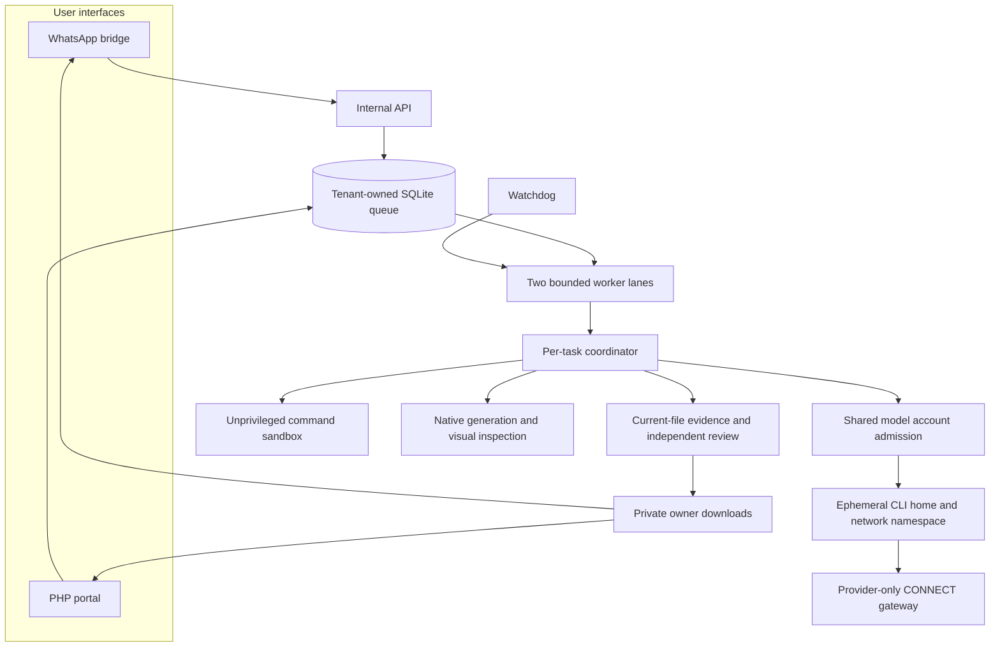
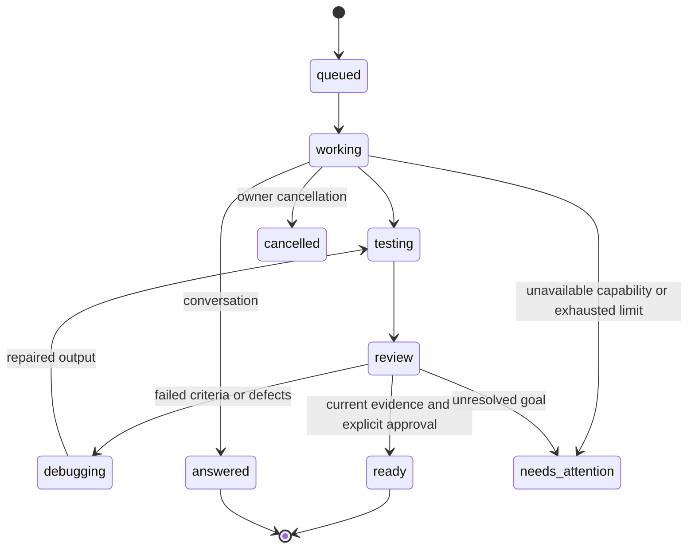

# CW Agent architecture

The trusted coordinator controls task state, tools and release gates. AntiGravity supplies task decisions and generates the user's outputs. Generated files and temporary playbooks are untrusted task data.

## State and isolation

The queue, task ownership, notifications and heartbeats are durable. Each user sees their own projects and downloads. A task subprocess imports controller code and executes selected roles sequentially against shared task memory. Independent queue lanes may run separate tasks concurrently. Shared per-profile locks prevent overlapping credential use.

The CLI receives a temporary home with only its required provider credentials. Its namespace exposes a narrow model proxy rather than host network access. Generated commands run under an unprivileged account with controlled filesystem mounts and no external dependency downloads.

## Action protocol

Decision sessions use the custom `cw-controller` agent and a phase-specific structured-object schema. The controller validates actions before running tools. Native image sessions use a separate protocol and dedicated native-media instructions. Their complete original request accompanies every design or repair proposal.

Actual native reference images must be opened before generation delegation. Raster export requires explicit creation, a completed native generation tool, decoded bytes and a hash different from the inputs. Native inspections must open the current pixels.

## Release state machine

This diagram shows logical stages; the durable task row uses broader status values alongside role/cycle progress. It is not a list of extra database statuses.

File fingerprints invalidate stale evidence. Repair and recovery retain task history and model counters. Notifications distinguish pending, sending, sent and uncertain delivery. Uncertain sends are not blindly repeated.

## Source map

| Component | Main files |
|---|---|
| Queue and coordinator | `state.py`, `worker.py`, `queue_worker.py`, `task_runner.py`, `watchdog.py` |
| Model decisions | `agent.py`, `action_schema.py`, `skill_loader.py`, `agents/`, `skills/` |
| Isolation and transport | `cli_sandbox.py`, `exec_sandbox.py`, `model_gateway.py`, `scope_transport.py`, `process_control.py` |
| Tools and evidence | `tools.py`, `autonomy.py`, `deliverables.py`, `media.py`, `browser_runner.py` |
| Native presentations | `artifact-runtime/` |
| User interfaces | `portal/`, `internal.py`, `whatsapp/` |

[Deployment](DEPLOYMENT.md) · [Capabilities](CAPABILITIES.md) · [Operations](OPERATIONS.md)
