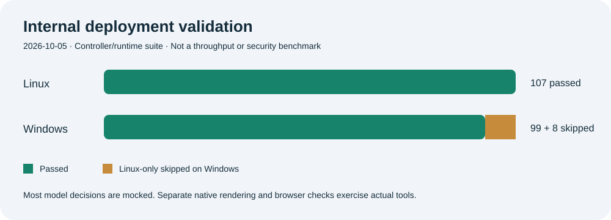

# Validation scope

| Internal deployment check | Observed result |
|---|---|
| Linux controller/runtime suite | 107 checks passed |
| Windows suite | 99 passed, 8 Linux-only skipped |
| Fresh portal browser contexts | Desktop 1440×900 and mobile 390×844 passed |
| Portal checks | Signup/login, authenticated state, tenant separation, CSRF handling; no JavaScript errors or horizontal overflow |
| Native presentation | Actual 10-slide PPTX built, rendered, independently inspected and sent through the connected bridge |
| Native image | Actual JPEG generation and native pixel inspection exercised; some user outputs still required repairs |

This is an internal deployment snapshot from 2026-10-05. Most controller model decisions in the unit suite are mocked. Native presentation runtime checks execute actual rendering, and Linux admission checks use real file locks. Public test files are excluded at the owner's request. The chart represents test outcomes, not a benchmark of AI intelligence, application coverage or security assurance.

Provider image capacity errors and remaining visual defects were observed. That image capability check does not establish that a photorealistic user request met every quality requirement. Model review is fallible; operators should evaluate important outputs independently.

The published copy replaces the owner's host with placeholders and renames the production browser verifier to `browser_runner.py`. Syntax, runtime references, documentation links, placeholders and the complete public file list are checked before publication. No private project history or raw evidence logs are published.
